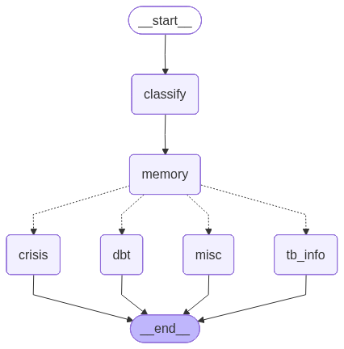

# TB-TST Support Bot

A conversational support bot for TB (tuberculosis) patients undergoing treatment. Built on [LangGraph](https://github.com/langchain-ai/langgraph), [AWS Bedrock](https://aws.amazon.com/bedrock/), and [Chainlit](https://chainlit.io). Responds in Spanish.

The bot classifies each message and routes it to one of three specialist nodes: a **TB information node** (RAG over curated Spanish TB documents), a **DBT skills node** (emotional support via Dialectical Behavior Therapy techniques), or a **crisis node** (static safety response when self-harm risk is detected). A safety classifier runs on every message before any specialist node fires.



---

## Setup

**Requirements:** Python 3.11+, `uv`, AWS credentials with Bedrock access.

```bash
uv sync
cp sample-env.txt .env   # then edit .env for your environment
```

**Initialize the Chainlit session database** (run once before first launch):

```bash
uv run python scripts/init_chainlit_db.py
```

---

## Environment Variables

### Local development

| Variable | Default | Notes |
|---|---|---|
| `AWS_REGION` | `us-west-2` | Also accepts `AWS_DEFAULT_REGION` |
| `BEDROCK_MODEL_ID` | `global.anthropic.claude-sonnet-4-6` | Any Bedrock-accessible Claude model |
| `AWS_PROFILE` | — | Named profile from `~/.aws/credentials` |
| `TBTST_VARIANT` | `full` | `full` (DBT subgraph) or `mini` (single DBT node) |
| `TBTST_LOG_LEVEL` | `INFO` | `DEBUG` / `INFO` / `WARNING` |
| `TBTST_DEBUG_METRICS` | `0` | Set to `1` for per-call latency logs |
| `TBTST_LOG_PROMPT_SIZES` | `0` | Set to `1` to log token counts |

### EC2 / IAM role deployment

On EC2, `config.py` detects the instance metadata service (IMDSv2) and **automatically removes `AWS_PROFILE`** so the default credential chain uses the attached IAM role. You do not need to set `IS_EC2`.

| Variable | Default | Notes |
|---|---|---|
| `AWS_REGION` | `us-west-2` | Required |
| `BEDROCK_MODEL_ID` | `global.anthropic.claude-sonnet-4-6` | Required |
| `TB_FORCE_AWS_PROFILE` | — | Set to `1` to override EC2 auto-detection and force using `AWS_PROFILE` |

The IAM role on the instance must have `bedrock:InvokeModel` permission on the target model ARN.

### Session persistence

| Variable | Default | Notes |
|---|---|---|
| `TBTST_CHECKPOINT_DB` | `./data/langgraph_checkpoints.db` | SQLite path for LangGraph state |
| `TBTST_CHAINLIT_DB` | `./data/chainlit.db` (SQLite) | Async URL for Chainlit data layer |
| `DATABASE_URL` | — | Postgres URL; auto-upgraded to `asyncpg` driver |

For multi-instance deployments, set `TBTST_CHECKPOINT_DB` to a shared path or migrate to `PostgresSaver`. Set `TBTST_CHAINLIT_DB` (or `DATABASE_URL`) to a shared Postgres instance.

### RAG

| Variable | Default | Notes |
|---|---|---|
| `CHROMA_PERSIST_DIR` | `./cache/chroma` | ChromaDB index location |
| `TBTST_EMBED_MODEL` | `hiiamsid/sentence_similarity_spanish_es` | HuggingFace embedding model |
| `RAG_DOCS_DIR` | `src/TB-RAG-documents` | Source `.txt` documents |
| `RAG_FORCE_REBUILD` | `0` | Set to `1` to force index rebuild on next start |

See [`docs/rag.md`](docs/rag.md) for full RAG documentation and the GENERAL/LATENT split.

---

## Running

**Chainlit UI (standard):**

```bash
chainlit run chainlit_app.py
```

**With explicit variant:**

```bash
TBTST_VARIANT=full chainlit run chainlit_app.py
```

**CLI mode (no UI, useful for scripted testing):**

```bash
uv run python -m tbtst_bot.app --variant full
uv run python -m tbtst_bot.app --variant mini
```

**Archived bot versions** (see [`archive/README.md`](archive/README.md)):

```bash
ARCHIVE_VERSION=dbt-mini chainlit run archive/chainlit_app.py
```

---

## Project layout

```
chainlit_app.py          — Chainlit entry point (UI layer, session management)
ui_types.py              — shared UI type definitions
src/tbtst_bot/           — core bot package
  graph.py               — LangGraph graph: nodes, routing, state
  config.py              — AWS/Bedrock setup, EC2 IAM auto-detection
  rag_utils.py           — ChromaDB retrieval, fingerprint-based rebuild
  prompts.py             — prompt file loader
  app.py                 — CLI entry point
  db.py                  — database helpers
prompts/                 — active prompt files (plain .txt)
  DBT/                   — module-specific DBT prompts (dt/er/ie/mind)
personas/                — patient persona profiles (loaded at chat start)
resources/               — static JSON knowledge bases
src/TB-RAG-documents/    — Spanish TB source documents for RAG
cache/chroma/            — persisted ChromaDB vector index (auto-built)
diagrams/                — graph diagrams (.mmd + .png)
archive/                 — older bot versions (see archive/README.md)
tests/                   — test suite (see docs/testing.md)
scripts/                 — one-off setup scripts
```

---

## Testing

```bash
# All unit tests (no Bedrock, no cost)
uv run pytest -q

# Integration tests (calls real Bedrock — costs money)
RUN_BEDROCK_TESTS=1 uv run pytest -q -m integration
```

See [`docs/testing.md`](docs/testing.md) for full documentation of every test class, the `FakeLLM` patching architecture, and the session crash regression suite.

---

## Prompt files

Prompts live in `prompts/` as plain `.txt` files. If you use Python `.format()` on prompt strings containing JSON, escape braces: `{{` and `}}` for literal `{` and `}`, leave `{placeholder}` unescaped.

The DBT FULL graph uses module-specific prompts from `prompts/DBT/` (dt, er, ie, mind). The archived DBT Mini version used a single `dbt_system.txt` (now in `archive/dbt-mini/prompts/`).
